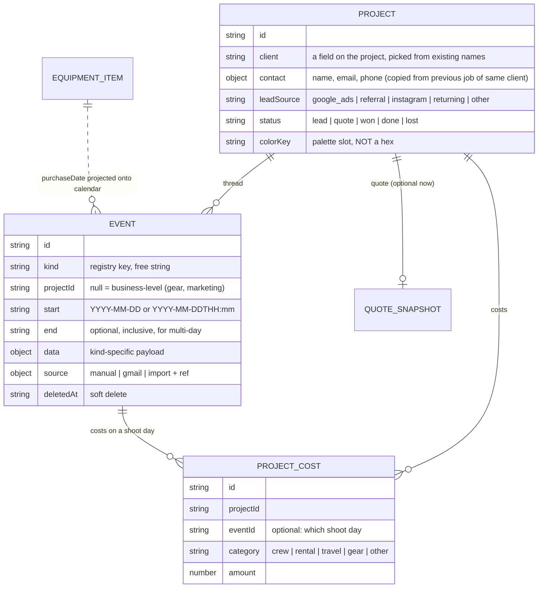

# Plan: Calendar & Project Threads

> Follows [PLAN-V3-PROJECT-HUB.md](PLAN-V3-PROJECT-HUB.md) (phases 0–3 done, phase 4 Finance in progress
> by a separate agent). Source: M.J. brainstorm, 2026-10-08.
> Track numbers here are **T1–T8** so they don't collide with the v3 phase numbers.

---

## 1. The idea in one paragraph

Every job is a **thread**: lead email → reply → quote sent → accepted → shoot days → post-production
→ deadline → invoice sent → invoice paid. Each step is a **dated event**. The **Calendar** is the
place where you see and add those events across all projects. Every other part of the app (project
page, Finance, Gear, marketing stats) **reads the same events** instead of keeping its own dates.
Store dated facts once. Every statistic ("how fast did I reply", "how long until I got paid", "how
many post days did this take", "how much gear did I buy this month") is *computed* from them, never
stored.

---

## 2. What you described, sorted

| Area | Wants | Lands in |
|---|---|---|
| Calendar | Separate tab, full month view, click a day → add typed event (iOS-style), easy editing, retrofill all of 2026 | T2 |
| Event types | Lead in, reply, quote sent, won/lost, shoot days, post-production days, deadlines, invoice sent, invoice paid, gear purchase | T1 |
| Colour | Tile colour = project; small marker + short label = event type (e.g. Tchibo: yellow tile, pink "mail" marker on 9 Oct, orange "zdjęcia" marker on 28 Oct) | T2 + design pass |
| Lead tracking | Source, response time, lead progression (new → advanced → won/lost), editable later | T3 |
| Thread → quote | Quote picks up the thread; client details from the lead prefill the quote | T3 |
| Gmail | Pull dates/details from emails, ideally AI-filled | T4 (import) → T8 (in-app) |
| Shoot / Realizacja | Own project tab: crew, gear, actual costs per shoot day; Profit tab moves here out of the calculator; call sheet planner attaches here | T5 |
| Money loop | Quote = planned revenue; real costs + invoice = actual; days-to-payment stat | T6 |
| Insights | Response time, conversion, effort per project for future estimating, gear spend per month, marketing / Google Ads performance | T7 |
| Design | Proper palette from a design pass, readable in dense month view | before T2 |

---

## 3. Data architecture (most of the work is here)

### 3.1 Entities



### 3.2 The event record

```ts
// lib/event-types.ts (sketch)
eventSchema = z.object({
  id:        z.string().min(1),
  kind:      z.string(),                 // NOT z.enum: unknown kinds must survive
  projectId: z.string().nullable().catch(null),
  start:     z.string(),                 // 'YYYY-MM-DD' or 'YYYY-MM-DDTHH:mm' (time optional)
  end:       z.string().optional(),      // inclusive; shoot/post ranges
  title:     z.string().catch(''),
  notes:     z.string().catch(''),
  data:      z.record(z.unknown()).catch({}),   // validated per kind, never stripped
  source:    z.object({ type: z.string(), ref: z.string().optional() }).passthrough()
               .catch({ type: 'manual' }),      // gmail → ref = message/thread id (dedupe)
  createdAt: z.string().catch(''),
  updatedAt: z.string().catch(''),
  deletedAt: z.string().optional(),
}).passthrough()
```

Stored in `events.json` through the existing `createCollectionStore` (Tauri AppData / localStorage).

### 3.2a Client is a field on the project, not a separate record *(decided 2026-10-08)*

There is no clients file. The client is a property of the project, like the status. To avoid the
usual problem with free text ("Tchibo" / "Tchibo Polska" / "tchibo" counting as three clients):

- The client input is a **picker over names already used**, with free typing for a new client.
- Grouping uses a normalised key (trimmed, case- and diacritic-insensitive), so small spelling
  differences still group together. A "merge names" action in Settings fixes real duplicates by
  rewriting the field on the affected projects.
- Picking an existing client **copies contact details** from that client's most recent project, so
  repeat clients still prefill the lead and the quote.
- "How much did this client bring in" = filter the projects by client and sum their financials. That
  is a pure function, like every other stat.
- If we ever need real client records, they can be built from these names in one pass without
  losing anything.

### 3.3 Kind registry (code, not data)

`lib/event-kinds.ts`: one entry per kind:

| key | group | range? | payload (`data`) | side effect |
|---|---|---|---|---|
| `lead_in` | sprzedaż | no | channel, contact, first message summary | creates project as `lead` |
| `reply_sent` | sprzedaż | no | — | (feeds response-time stat) |
| `quote_sent` | sprzedaż | no | amount netto snapshot, quote version | suggests status `quote` |
| `follow_up` | sprzedaż | no | — | |
| `won` / `lost` | sprzedaż | no | reason (lost) | suggests status `won` / `lost` |
| `prep_day` | produkcja | yes | recce / meeting | |
| `shoot_day` | produkcja | yes | call sheet id, location | anchors crew/gear/costs |
| `post_day` | postprodukcja | yes | hours (optional) | effort stat |
| `deadline` | postprodukcja | no | what is due | |
| `invoice_sent` | pieniądze | no | number, amount netto, due date | |
| `invoice_paid` | pieniądze | no | amount received | suggests status `done` |
| `gear_purchase` | firma | no | (projected from catalogue `purchaseDate`) | |
| `marketing` | firma | yes | campaign, spend | |
| `note` | inne | yes | — | |

Each kind has: label, group, colour **token**, which fields its add-form shows, a Zod schema for
`data` (all `.catch()`), and an optional "suggest status" effect. Suggestions are always confirmed by
you; the app never changes a project status silently.

### 3.4 Rules that make it safe to change our minds

These rules let us use it for a few weeks, decide it's wrong, and change it without losing data.

1. **Facts stored, stats derived.** "Days to payment" is never saved; it's `invoice_paid − invoice_sent`
   computed by a pure function. New or changed stats never need a data migration.
2. **Every date lives in exactly one place.** Gear purchases stay on the catalogue item
   (`purchaseDate`) and are *projected* onto the calendar. They are not copied into events.
3. **Kind keys are permanent; everything about them is cosmetic.** Labels, colours, groups and form
   fields can change freely. A key is never renamed. If two kinds merge, add an alias map in the
   registry and leave the data alone.
4. **Unknown is kept, not dropped.** `kind` is a free string, `data` is an open record, schemas use
   `.passthrough()`. An older build opening newer data shows an unknown kind as a grey "inne" tile
   and writes it back untouched. (We already got bitten by `z.object` stripping keys:
   `migratedFromQuoteId`. New schemas must default to passthrough.)
5. **Additive changes only by default.** New field = optional + `.catch(default)`. No version bump.
   A real breaking change bumps `version` and gets a migrator with backup-or-abort, using the
   pattern that already exists in `project-migration.ts`.
6. **Soft delete.** `deletedAt` instead of removing. Gmail re-imports stay idempotent (a deleted
   suggestion doesn't come back) and mistakes can be undone.
7. **Colours are palette slots, not hex.** `Project.colorKey = 'amber'`. The palette can be
   redesigned at any time without touching data.
8. **Imports go through review.** Gmail/AI produce *proposed* events; nothing lands without your
   accept. `source.ref` (Gmail message id) dedupes.

### 3.5 Changes to existing models (all additive)

- `Project.status` gains `lead` before `quote`. Older data still parses (the enum `.catch` defaults
  to `quote`).
- `Project.quote` becomes **optional**: a lead has no quote yet. The calculator bridge
  (`project-hub-context.tsx`) opens an empty calculator when there's none. ⚠️ This touches the bridge.
- `Project.client` stays a string (now with a picker); new optional `Project.contact` and
  `Project.leadSource`. No clients file (§3.2a).
- `Project.colorKey`, auto-assigned round-robin from the palette, changeable.
- `Project.date` (ledger date) stays manual for now. Later it can default from events (e.g. first
  shoot day or invoice date).

---

## 4. Screens

**Navigation:** **Kalendarz** (new landing tab) · Projekty · Finanse · Sprzęt · Ustawienia.
Projects stays a clean list for when you only want to look at jobs.

**Kalendarz**
- Full month grid, week rows. Multi-day events (shoot, post) render as bars across days.
- Each item: **tile tinted with the project colour**, plus a **small solid marker in the event-type
  colour with a 1–2 word label** ("mail", "zdjęcia", "FV"). The type is also written as text, so you
  don't have to rely on colour alone.
- Business-level items (gear purchase, marketing) use a neutral tile with only the type marker.
- Click a day → sheet: pick type → type-specific fields → pick project (or "nowy lead" creates one).
  Click an item → edit. Drag to move/resize (later).
- Layer toggles per type group (sprzedaż / produkcja / post / pieniądze / firma) and a project
  filter, so a busy month can be thinned out.
- Month summary strip: leads in, shoot days, post days, invoiced, paid, gear spend.

**Projekty (list)**: leads will far outnumber jobs, so filtering is required, not optional.
- **Default view = jobs only** (`won` + `done`). Leads, open quotes and lost ones are hidden until
  you ask for them.
- Status chips you can combine: Leady · Wyceny · W realizacji · Zrealizowane · Nieprzyjęte.
  The current "Wszystko / Tylko projekty / Tylko wyceny" filters are replaced by these.
- Client filter (the same picker) with that client's total revenue shown when it's active.
- Year filter; the last-used filters are remembered.
- Same filter logic as pure functions in `lib/`, so Calendar and Finance can reuse it.

**Project page tabs**: `Oś czasu · Klient/Lead · Wycena · Realizacja · Notatki`
- *Oś czasu*: the thread as a vertical timeline, with derived numbers inline ("odpowiedź po 6 h",
  "zapłacono po 23 dniach").
- *Wycena*: today's calculator, prefilled with client data from the lead.
- *Realizacja*: shoot days from events; per day: crew, gear (today's Sprzęt tab moves in here),
  actual costs. The current **Profit** tab moves out of the calculator to here as "planned vs actual".
  The call sheet planner (old phase 5) attaches to a shoot day here.

---

## 5. Gmail + AI: is it doable?

Yes, and there are two ways. Start with the cheap one; the second reuses all of it.

**A. Now: Claude Code session as the importer (no new infrastructure).**
This session already has a working Gmail connection. I search your mail for client threads, extract
dates and details (lead received, your reply time, quote sent, acceptance, invoice mails), and write
a `proposed-events.json` file in an agreed format. The app gets a **review queue**: accept / edit /
reject each proposed event, matched to a project or creating one. This is how we retrofill 2026.
Afterwards you can say "sync my mail" every week or two.

**B. Later: in the app itself.**
Google OAuth from the Tauri app (a Google Cloud project you own, `gmail.readonly`, fine for personal
use with some one-off setup friction), plus a Claude API call that turns a thread into the same
proposed-event format. Needs an Anthropic API key stored in the macOS keychain. The cost per thread
is negligible.

The **import format + review queue** is the shared part, so A isn't throwaway work. It is also why
rule 8 exists: the AI suggests, you confirm.

Google Ads works the same way: start with manual monthly spend (already exists as a `FixedCost` of
type `marketing`) plus `lead source`. That alone gives cost per lead and cost per won job. API import
can come later.

---

## 5a. Claude ↔ desktop app data bridge *(decided 2026-10-08)*

Gmail work and data cleanup stay **in the chat with Claude Code**. There's no AI inside the app.
Claude writes to the **same local files the desktop app reads**, so when you open the app from the
Dock the data is already there. You don't need to look at the preview for this.

- **Where:** `~/Library/Application Support/com.michal.quotegen/` (today: `quotes.json`,
  `settings.json`; v3 adds `projects.json`, `equipment.json`, `finances.json`, `events.json`).
  The browser preview uses separate localStorage and is only for testing the UI, never real data.
- **Lane 1 — inbox (anything Gmail-derived):** Claude writes `inbox/*.json` with *proposed* events and
  project changes. The app shows them in the review queue; accepting writes them into the real files.
  You stay the one who confirms.
- **Lane 2 — direct edits (only when you ask in chat):** cleanups like "merge these client names" or
  "fix the 2026 shoot dates". Claude edits the real files directly, making a timestamped backup first.
- **No hand-written JSON.** Claude writes through a repo script (`npm run data -- …`) that uses the
  app's own Zod schemas, so a malformed record is rejected loudly instead of silently skipped by the
  app's defensive parser.
- **App picks up changes:** reload collections when the window regains focus (small addition). Saving a
  single record already re-reads the file before writing, so it won't overwrite what Claude added.
  Bulk writes (`replaceAll`, e.g. migration) must do the same before T4 ships.
- **Prerequisite:** a desktop build of the new app (see §5b).

## 5b. New app alongside the old one *(decided 2026-10-08)*

The hub ships as a **separate desktop app**, not an update of QuoteGen. The old QuoteGen
(`com.michal.quotegen`, "NonoiseMedia QG") stays installed and working for real-life quoting until
the hub has earned its place.

- **Own identity:** new Tauri `identifier` (e.g. `com.michal.nonoise-hub`) and `productName`, which
  gives it its **own data folder** and its own Dock icon. The two apps never write to each other's files.
- **Quotes come in read-only:** the hub's migration *reads* the old app's
  `~/Library/Application Support/com.michal.quotegen/quotes.json` and never writes there. This needs
  a read-only filesystem permission for that one path in the hub's Tauri capabilities. The existing
  backup-before-migrate rule stays.
- **Re-import is safe:** quotes you keep making in the old app can be pulled in again later.
  `migratedFromQuoteId` already makes this idempotent, so nothing gets duplicated.
- **Same repo for now:** both apps build from this codebase (the old one from `master`, the hub from
  `v3/project-hub`). Whether the hub gets its own repo or app folder can be decided when it ships;
  it isn't needed to keep developing.
- The Claude bridge (§5a) targets the **hub's** folder only.

## 5c. Calendar design system *(design pass, 2026-10-08)*

The mockup (`/design-lab`, variants A–D on example data) lived in commit `ab9c69d` and was removed in
T2 once the real calendar shipped. Check out that commit to see the variants again.

**Two colour channels, separated by form, not just hue** (`lib/calendar-palette.ts`):
- **Project = tile.** Dark tint (OKLCH L 0.30) + 3 px edge in the bright hue (L 0.74) + light text.
  12 slots, ~30° apart. Stored as a key (`'lemon'`), never a hex.
- **Event type = chip.** Small solid chip (L 0.81) with dark text and a 1–2 word label. 5 groups:
  Sprzedaż = pink (mails), Produkcja = brand orange (shoot is the key day), Postprodukcja = violet,
  Pieniądze = green, Firma = cyan, plus grey "inne".
- Because the chip is light and solid and the tile is dark and muted, even same-hue pairs (orange shoot
  chip on an orange project) stay readable. The label means the meaning never depends on colour alone,
  which also covers colour blindness.
- Events without a project (gear, marketing, notes) get a neutral grey tile.

**Measured:** every colour is inside sRGB (chroma tuned per hue so browsers don't clip and shift it).
Contrast: tile text ≥ 11:1, chip text ≥ 9.6:1, chip against tile ≥ 7:1 (WCAG AA needs 4.5:1).

**Known limits:**
- Neighbours in the 12-slot ring are close at dark tints: coral/rose/orange, lemon/amber/lime,
  teal/cyan. The assignment order (step 5 around the ring) gives consecutive new projects distant hues,
  and thread focus resolves any doubt.
- Dark yellow reads slightly olive. That's a physical property of yellow on dark backgrounds; the
  bright edge carries the "yellow".

**Interaction rules:**
- Click a tile → **thread focus**: that project's events stay lit, everything else drops to 18 %
  opacity, and the side panel shows the thread as a timeline with derived numbers ("Odpowiedź po
  4 h 26 min", "Zapłacono po 23 dniach"). Esc or "Pokaż wszystkie projekty" exits.
- Click a day → side panel lists that day's events + "Dodaj" (event types grouped like the layers).
- Layer chips above the grid are both the legend and the on/off toggles.
- Max 3 lanes per week row; overflow shows "+N więcej" per day. Multi-day events are bars that
  continue across week rows (flat edge where they continue).
- Brand typefaces: Archivo for the month title and panel headings, JetBrains Mono for day numbers,
  dates and counts (timecode feel). Inter for everything else, matching the app.
- Phone width: tiles collapse to colour bars and the day panel carries the details.

**Variants to compare (2026-10-08).** `/design-lab#a` … `#d` switch between four ways of showing the
same month. Everything else (header, layers, day/thread panel, thread focus) is shared, and each variant
has its own pair matrix at the bottom:

| | Project shown by | Type shown by | Multi-day | Strength | Cost |
|---|---|---|---|---|---|
| **A Kafle** | dark tile + left edge | light chip + label | spanning tile | balanced, compact | rounded "app" look |
| **B Montażówka** | solid mid-tone clip fill, square | 3 px band on the **top** edge + label | spanning clip, open edge when it continues | most colour at a glance; editing-timeline language; playhead for today | busiest; fills compete with each other |
| **C Nici** | coloured line across the week, one lane per project | bead (pill) on the line | line thickens | the thread is literally visible; focus reads as one line | tallest (≈2× A on phone); quiet projects still draw lines |
| **D Agenda** | colour of the project name only | **shape** + colour (● ■ ▲ ◆ ✚) + muted label | thin rule above the day's list | calmest; type readable without colour; big Archivo numerals | least colour at a glance; long names truncate first |

**Decision 2026-10-08: A (Kafle) is the chosen direction** and is what T2 shipped. `lib/oklch.ts` now
guards the palette: tests fail if any tile/chip colour leaves sRGB or drops below 7:1 text contrast,
or if a type chip stops standing out (≥ 4.5:1) against any project tile.

**Code ready for T2:** `calendar-layout.ts` (month grid, lane packing, overflow; DST-safe, 9 tests),
`calendar-palette.ts`, `event-kinds.ts` (first draft of the registry from §3.3).

## 6. Tracks, in order

| Track | What | Depends on |
|---|---|---|
| **Design pass** | Palette: ~12 project hues + 5 type-group accents that stay distinct when combined, dark theme, small sizes. Month-view mockup. | — |
| **T1a Event foundation** ✅ | `event-types.ts` (lenient schema: only a missing `id` drops a record), `event-kinds.ts` (per-kind `data` schemas read without rewriting storage, forward-only `statusSuggestion`), `events-store.ts` (`events.json`, soft delete/restore), `thread-stats.ts` (numbers + Polish sentences; invoices paired by number, then by date; paid/open/planned). 37 tests incl. a newer-version round trip; 8/8 deliberate mutations caught. | — |
| **T1b Project additions** ✅ | Status `lead` (first in thread order; counts toward nothing; sits in the "wyceny" filter until T3). Optional `colorKey` (new projects get the least-used slot; older ones a stable slot hashed from id, frozen by their first save; reading never writes), `contact`, `leadSource` (`LEAD_SOURCES` as suggestions; the message channel stays on the `lead_in` event, so contact and source live only on the project). `quote` nullable: opening a lead loads a clean calculator with the client prefilled; backfill and the "missing financials" banner ignore leads. `projectSchema` is now `.passthrough()`. 9 new tests; 8/8 mutations caught. | — |
| **T2 Calendar tab** ✅ | `components/calendar/`: landing section „Kalendarz"; month grid (variant A), month summary incl. gear spend, layer toggles, thread focus with derived numbers, day panel. Add/edit form with per-kind fields, time for sales events, ranges, „+ Nowy lead…" (creates a `lead` project), forward-only status suggestion with confirm, soft delete with „Cofnij". Gear purchases are written to the **catalogue** (purchase date) and projected, never stored as events. `EventsProvider` reloads on window focus (bridge-ready, §5a). Pure: `calendar-entries.ts`, `event-draft.ts` (edits keep unknown fields, `data` keys and import source). 11 + palette tests; 8/8 mutations caught; full flow verified in the browser. | — |
| **T3 Lead → thread** | "Nowy lead" flow, client picker + contact copy, project-list filters (jobs-only default), Oś czasu tab, status suggestions, quote prefill from lead. | T1 |
| **T4 Gmail import v0** | Data script (`npm run data`), inbox format, review queue in app, refresh-on-focus, then retrofill 2026 via Claude Code + Gmail (§5a). | T1, T3, v3 desktop build |
| **T5 Realizacja tab** | Profit pulled out of calculator, shoot days, crew, gear (merge Sprzęt tab), actual costs; then call sheet planner. | T1 |
| **T6 Money loop** | Invoice events → actual revenue, planned vs actual in Finance, days-to-payment, overdue list. | T5, phase 4 |
| **T7 Insights** | Response time, conversion by source, effort (post days) vs quoted, gear spend/month, cost per lead. | T4, T6 |
| **T8 In-app Gmail + AI** | OAuth + Claude API producing the T4 format. Optional. | T4 |

The first usable milestone is **T1 + T2 + T3**: a calendar you can fill by hand and project threads
that start at the lead. T4 then fills in 2026 for you.

---

### Follow-ups noticed during T1–T2

- The Sprzęt screen has no field for `purchaseDate`; the calendar form is currently the only way to
  set it. Add a date column/field there (T5 touches the gear tab anyway).
- Deleting a project leaves its events behind; the calendar shows them as „Usunięty projekt" on a
  neutral tile. Decide: soft-delete the thread with the project, or offer to reassign.
- Layer toggles and the viewed month are not remembered between launches.

- `Project.date` still has no `.catch`, so a project with a malformed date is dropped on read and
  lost on the next collection write (pre-existing; an existing test asserts it). Worth relaxing
  the same way events were, once the finance views handle an undated project.
- The project bar now wraps the status switcher onto a second row (5 statuses). Redesign as
  part of T3's project tabs.
- Opening a project whose snapshot has no `pdfDraft` keeps the previous project's PDF draft
  (pre-existing calculator behaviour, now also hit by leads).

## 7. Decisions

Confirmed 2026-10-08:
1. **Landing tab:** Kalendarz is the default screen.
2. **Lead = project with status `lead`**, and the project list **hides leads by default** (§4).
3. **Client is a field on the project**, not a separate record (§3.2a).
4. **Status changes** are suggestions you confirm.
5. **Profit tab:** only the screen moves to Realizacja. The data stays where it is (planned costs
   inside the project's quote) and Realizacja adds actual costs next to it. One set of data, several
   views of it.

6. **Gmail and AI stay in the chat** (route A). Claude writes to the app's local files through the
   bridge in §5a; no in-app Gmail login or API key. T8 is dropped unless that changes.

## 8. Coordination with the phase-4 agent

- Phase 4 owns `finance-calc.ts`, `finances-store.ts` and the financials backfill. T1 should start
  **after phase 4 is merged** into `v3/project-hub`, or on a branch rebased onto it, because both
  edit `project-types.ts`.
- T6 extends phase 4's dashboard (planned vs actual) rather than building a second one.
