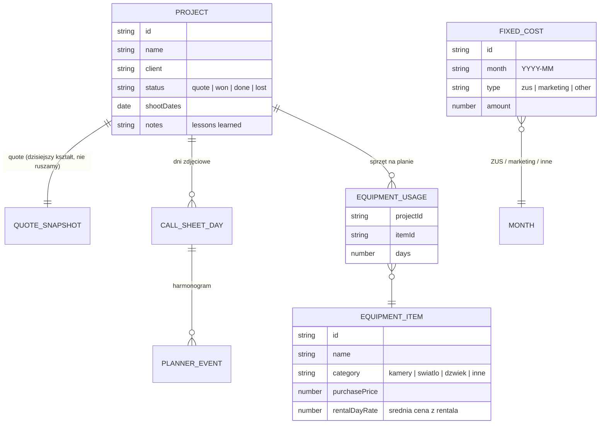

# Plan przebudowy: Nonoise QuoteGen → Project Hub (v3)

> Cel: z kreatora wycen zrobić **kombajn do zarządzania projektami i kokpit finansowy firmy**,
> z wciągniętym planerem dnia (CallSheetWiz), bez psucia tego, co działa.
> Data planu: 2026-08-18. Źródło: notatki głosowe M.J. + inwentaryzacja kodu.

---

## 0. Stan obecny (inwentaryzacja)

**QuoteGen** (`~/Documents/VibeCoding/QuoteGen`) — baza przebudowy:
- Next.js + Tauri (apka desktopowa) + shadcn/ui, dark theme.
- Taby kreatora: Preprodukcja / Produkcja / Postprodukcja / Dodatkowe / **Profit** / Podgląd PDF.
- Silnik: `lib/quote-calc.ts`, `lib/profit-calc.ts` (koszty paliwa/dojazdu), `lib/pricing-config.ts`, kursy NBP (`lib/nbp-fx.ts`).
- Zapisy: `lib/quote-library.ts` — **wersjonowany snapshot** (`QuoteSnapshot v2`) w jednym `quotes.json` (Tauri AppData) / localStorage (web). To jest nasz punkt zaczepienia pod migrację.
- ⚠️ Git: **cała aktualna praca jest na branchu `feature/tauri-pdf-html2canvas`** (10+ commitów przed `master`; master nie ma nic ekstra — czysty fast-forward).

**CallSheetWiz** (`~/Documents/VibeCoding/CallSheetWiz`) — do wchłonięcia:
- Planer dnia + call sheet z drukiem A4 (świeżo naprawiony print CSS), timeline z drag&drop.
- Czysta logika w `lib/` (time, editing-engine, schedule-types) — łatwa do przeniesienia.
- Zapisy: `SavedDay` w localStorage + eksport/import JSON.

---

## 1. Notatki uporządkowane — kategorie funkcjonalne

| # | Funkcja | Opis (z notatek) | Faza |
|---|---------|------------------|------|
| **A** | Zmiana tożsamości | Nie "apka do wycen", tylko menedżer projektów / kokpit biznesu | 2 |
| **B** | Lista projektów | Chronologiczna lista, szybkie przełączanie (rozwinięcie load/save), status **wycena vs zrealizowany projekt** (kolorami), filtry: tylko projekty / +wyceny / tylko wyceny | 2 |
| **C** | Finanse firmy | Widok kwartał / pół roku / rok (od 2026), agregacja profitów ze wszystkich projektów, koszty stałe: **ZUS miesięczny**, marketing, tabelka "inne koszty" | 4 |
| **D** | Katalog sprzętu | Pozycje z ceną zakupu i średnią ceną rentalową, kategorie (kamery / światło / inne…) | 3 |
| **E** | Wycena dwutorowa | Tryb szybki (jak dziś: kwoty w kilku kategoriach) **lub** rozwijana lista własnego sprzętu z checkboxami — sekcja katalogowa NIE wpływa na kwoty wyceny, służy jako "co biorę na plan" | 3 |
| **F** | Packing list | Z zaznaczonego sprzętu → lista rzeczy do spakowania na dany dzień | 3→5 |
| **G** | ROI sprzętu | Na bazie średnich cen rentalu liczymy, ile własny sprzęt "zarobił na siebie" per zlecenie + częstotliwość użycia → rentowność zakupów | 6 |
| **H** | Integracja planera | CallSheetWiz jako moduł tej apki, jednolity UI, call sheet powiązany z projektem + lista sprzętu na dzień | 5 |
| **I** | Wnioski z projektu | Sekcja notatek / lessons learned per projekt | 6 |
| **J** | KSeF API | Śledzenie realnych wydatków z systemu faktur — **ZAPARKOWANE** (poboczne) | 7 |
| **K** | Quick win: PDF | W PDF wyceny **netto ma być dużą, podświetloną kwotą**, brutto mniejszą (dziś odwrotnie; klienci B2B patrzą na netto) | 0 |

---

## 2. Architektura docelowa

### Nawigacja (shell)
Sidebar zamiast pojedynczego kreatora:

- **Projekty** — lista (statusy, filtry, chronologia) → widok projektu z tabami:
  `Wycena (dzisiejszy kreator) · Profit · Sprzęt/Packing · Call sheet · Notatki`
- **Finanse** — dashboard okresowy + koszty stałe
- **Sprzęt** — katalog + statystyki ROI
- **Ustawienia** — cennik (dzisiejszy pricing-config), teksty PDF, dane firmy

### Model danych (nowy, wersjonowany od dnia 1)



**Kluczowa decyzja:** `Project` **opakowuje** dzisiejszy `QuoteSnapshot` zamiast go przepisywać.
`quote-types.ts` (497 linii) zostaje nietknięty — projekt to nadzbiór wyceny. Dzięki temu
kreator działa od pierwszego dnia przebudowy, a migracja to "każda zapisana wycena staje się
projektem o statusie `quote`".

### Warstwa storage
- Rozszerzamy istniejący dualny mechanizm (`storage.ts`: Tauri AppData / localStorage) o pliki:
  `projects.json`, `equipment.json`, `finances.json`.
- Jeden moduł migracji z numerem wersji schematu; **przy pierwszej migracji robimy kopię
  `quotes.backup-<data>.json`** — stare dane nigdy nie są nadpisywane bez backupu.
- Agregacje finansowe (kwartał/rok, ROI sprzętu) = czyste funkcje w `lib/` z testami,
  niezależne od UI (wzór: dzisiejszy `profit-calc.ts`).

---

## 3. Zasady "nie zepsuć"

1. `master` = zawsze działająca apka. Praca na branchu `v3/project-hub`, małe commity.
2. Każda faza kończy się **deployowalną, używalną apką** — żadnych wielotygodniowych rozgrzebań.
3. Stare snapshoty (`QuoteSnapshot v2`) czytamy zawsze — migrator w jedną stronę + backup.
4. Logika licząca najpierw jako czyste funkcje z testami, potem podpinana do UI.
5. Kreator wycen pozostaje dostępny w niezmienionej formie, dopóki nowy shell go w pełni nie zastąpi.
6. CallSheetWiz (repo) zostaje jako archiwum — kopiujemy kod, niczego nie kasujemy.

---

## 4. Plan A→Z — fazy

### Faza 0 — porządki w git + quick win ✅ ZROBIONE
```bash
cd ~/Documents/VibeCoding/QuoteGen
git checkout master
git merge feature/tauri-pdf-html2canvas   # fast-forward, master = aktualny stan
git push origin master
git checkout -b v3/project-hub
git push -u origin v3/project-hub
```
- **[K]** Odwrócenie hierarchii netto/brutto w PDF (`quote-pdf-document.tsx` + `podglad-pdf.tsx`):
  netto = duża podświetlona kwota, brutto = mniejsza. Mały, samodzielny commit — może iść
  od razu na `master`, niezależnie od v3.

### Faza 1 — fundament danych ✅ ZROBIONE
- **Typy + schematy Zod** — `project-types.ts`: `Project`, `ProjectStatus`, `EquipmentItem`,
  `ProjectEquipmentUsage`, `FixedCost`, `ProjectFinancials`. Parsowanie defensywne
  (`.catch()`), uszkodzony rekord nie kasuje kolekcji.
- **Repozytoria** — wspólny `v3-store.ts` (dualność Tauri/localStorage wyjęta z `quote-library.ts`)
  + `project-library.ts`, `equipment-catalog.ts`, `finances-store.ts`.
- **Migrator** — `project-migration.ts` (I/O) + `project-migration-core.ts` (czyste mapowanie).
  Kopia zapasowa przed zapisem; brak kopii = migracja PRZERWANA; idempotencja przez
  `migratedFromQuoteId`; stara biblioteka wycen nietknięta.
- **Czysta warstwa licząca** — `finance-calc.ts` (okresy, agregacje, trendy) i
  `equipment-roi.ts` (ROI sprzętu, lista pakowania).
- **Testy** — 54 testy na wbudowanym runnerze Node (`npm test`), bez nowych zależności;
  resolver rozszerzeń w `scripts/`. Suita zweryfikowana mutacjami.

**Decyzja projektowa:** `Project.financials` to ZAMROŻONA migawka, nie wyliczenie w locie —
inaczej zmiana cennika zmieniałaby wstecznie wyniki zeszłych lat.

### Faza 2 — shell nawigacji i lista projektów **[A, B]** ✅ ZROBIONE
- **Shell** — `app-shell.tsx` z sidebarem (Projekty / Finanse / Sprzęt / Ustawienia).
  Świadomie BEZ routingu Next: apka to `output: 'export'` do Tauri, więc sekcje trzymamy
  w stanie klienta. Sekcje faz 3–4 mówią wprost, co powstanie, zamiast udawać.
- **Lista projektów** — chronologicznie, kolorowe statusy, trzy filtry z notatek,
  wyszukiwarka, tworzenie projektu z bieżącego stanu kalkulatora, usuwanie z potwierdzeniem.
- **Pasek projektu** — nazwa, data księgowa, przełącznik statusu (wycena → projekt jednym
  kliknięciem), zapis. Celowo NIE sticky: przyklejony zostaje nagłówek z sumą netto.
- **Migracja w UI** — baner z liczbą znalezionych wycen; uruchamiana RĘCZNIE, bo to ruch na
  realnych danych. Pokazuje lokalizację kopii zapasowej.
- **Most do kalkulatora** — `project-hub-context.tsx` siedzi pod `QuoteProvider` i spina
  wszystko dwoma wywołaniami: `loadQuoteSnapshot` przy otwarciu, `buildQuoteSnapshot`
  + policzone finanse przy zapisie. Kalkulator nie wie o istnieniu projektów.

**Zweryfikowane w przeglądarce** (skrypty CDP): nawigacja, tworzenie, zmiana statusu, filtry,
trwałość po przeładowaniu, migracja z kopią zapasową, nienaruszalność starej biblioteki,
daty księgowe z dat zapisania wycen, idempotencja. Zero błędów konsoli.

**Dług do fazy 4:** zmigrowane projekty nie mają policzonych finansów (lista pokazuje
„nie policzono"). Liczą się przy pierwszym zapisie projektu; masowy backfill zrobimy przy
dashboardzie finansowym, gdzie jest do tego naturalne miejsce.

### Faza 3 — katalog sprzętu **[D, E, F]** ✅ ZROBIONE
- **Sekcja Sprzęt** — `equipment-section.tsx`: CRUD pozycji (nazwa, kategoria, cena zakupu,
  średnia stawka rentalowa) + ROI per pozycja i sumy katalogu (zainwestowane, odpracowane,
  zwrot, spłacone) z paskiem postępu spłaty.
- **Sprzęt w projekcie** — nowa zakładka projektu obok „Wyceny". Checkboxy z katalogu,
  liczba dni per pozycja, „zastąpiony rental" dla projektu. Zaznaczenia trafiają do
  `Project.equipment` i NIGDY nie dotykają `QuoteData` — zweryfikowane w przeglądarce.
- **Lista pakowania** — podgląd na ekranie + wydruk A4 z kratkami do odhaczania, przez
  `react-to-print` (ten sam idiom co eksport oferty, bez globalnych reguł `@media print`).
  Kategorie w kolejności katalogu, nie alfabetycznej — tak się realnie pakuje wóz.
- **Odmiana liczby mnogiej** — `pl-plural.ts` (1 pozycja / 3 pozycje / 7 pozycji), bo polski
  ma trzy formy, a apka pokazywała „2 pozycji" i „1 dni".

**Decyzja:** katalog dostał WŁASNĄ zakładkę projektu zamiast wejść w tab Produkcja.
Użycie sprzętu jest danymi PROJEKTU, nie wyceny — trzymanie tego w kalkulatorze mieszałoby
warstwy i zmuszało go do wiedzy o projektach.

### Faza 4 — finanse firmy **[C]** (2–3 dni)
- Dashboard: rok / półrocze / kwartał (od 2026), przychody+profit z projektów o statusie ≥ won.
- Koszty stałe per miesiąc: ZUS, marketing, tabela "inne" (dowolne pozycje).
- Wynik firmy = suma profitów projektów − koszty stałe okresu. Wykres trendu (recharts już jest w projekcie).

### Faza 5 — wciągnięcie planera **[H, F]** (3–4 dni)
- Kopiujemy z CallSheetWiz: `lib/time.ts`, `lib/editing-engine.ts`, `lib/schedule-types.ts`
  (bez zmian) + komponenty do `components/planner/`.
- Restyle na design system Nonoise (glass-card, ambient-glow, kolory) — UI ma być jednolite.
- Call sheet przypięty do projektu (dni zdjęciowe projektu), import starych `SavedDay` z JSON.
- Lista sprzętu na dany dzień (z EquipmentUsage) → packing list w call sheet.
- Przenosimy naprawiony print CSS (A4, tabela z checkboxami) — działa, nie wymyślamy od nowa.

### Faza 6 — ROI sprzętu + wnioski **[G, I]** (1–2 dni)
- Statystyki per pozycja katalogu: ile razy użyta, suma "zarobku" (dni × śr. rental),
  % zwrotu ceny zakupu ("kamera spłacona w 73%").
- Tab "Notatki" w projekcie (wnioski / lessons learned) + zbiorczy widok wszystkich wniosków.

### Faza 7 — KSeF **(zaparkowane)** **[J]**
- Nie mieszamy w rdzeń. Jedyne przygotowanie teraz: `FixedCost`/wydatki mają pole `source`
  (`manual` dziś, `ksef` kiedyś). Research API KSeF jako osobne zadanie, wymaga backendu i kluczy.

---

## 5. Ryzyka i otwarte decyzje

| Ryzyko / decyzja | Rekomendacja |
|---|---|
| Tauri vs web | Zostawić dualność (storage.ts już ją obsługuje); v3 nie może zepsuć builda Tauri |
| Merge `feature/tauri-pdf-html2canvas` | Zrobić w Fazie 0 — to de facto trunk; bez tego v3 wisi na feature-branchu |
| Kształt `QuoteData` | Nie ruszać w fazach 1–4 (opakowanie w Project); ewentualny refactor dopiero po stabilizacji |
| Dwie apki, zdublowane shadcn/ui | Nie robić monorepo na siłę — kopiujemy planer do QuoteGen i tyle |
| Waluty | Finanse firmy liczymy w PLN (NBP FX już jest do przeliczeń w wycenie) |
| Nazewnictwo statusów | `quote` (wycena) / `won` (wygrany, w realizacji) / `done` (zrealizowany) / `lost` (nie wszedł) — pokrywa filtry z notatek |

---

## 6. Co się dzieje z CallSheetWiz?

Zostaje jako osobne repo-archiwum. Po Fazie 5 nowe funkcje planera rozwijamy wyłącznie
w QuoteGen. Świeże poprawki (print CSS, naprawa shoot date, zabezpieczenie ResizeObserver)
przenosimy razem z kodem.
